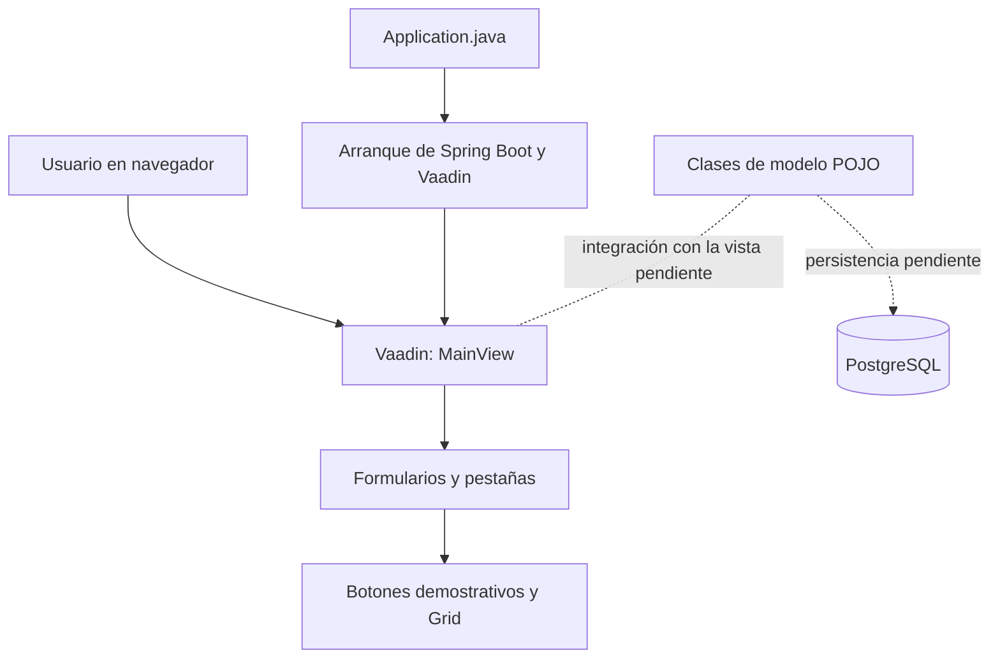
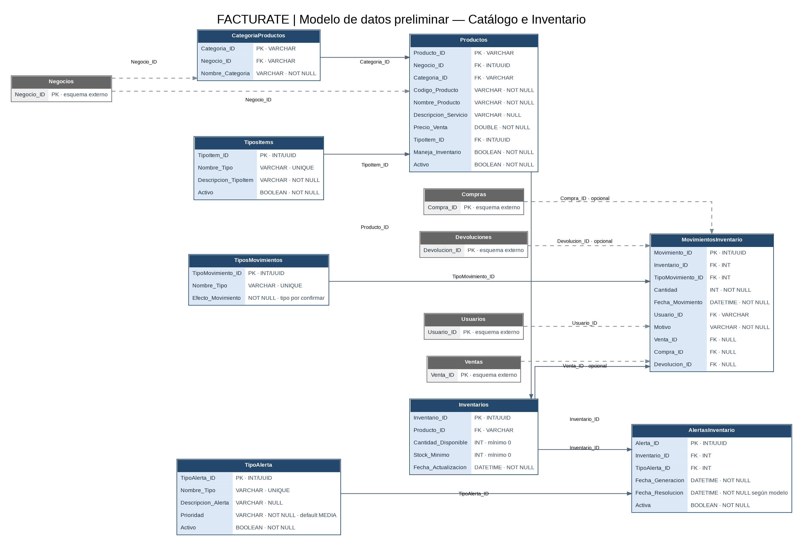

<div align="center">

# Facturate — Proyecto Integrador Grupo 4

**Aplicación académica para la gestión de catálogo e inventario de pequeños negocios**

[](https://github.com/julianz-dev/proyecto-integrador-b1-2026-2-g4)


[Repositorio en GitHub](https://github.com/julianz-dev/proyecto-integrador-b1-2026-2-g4)

</div>

---

## 1. Resumen ejecutivo

**Facturate** es un proyecto académico desarrollado en el marco del programa Técnico Laboral como Asistente en Desarrollo de Software de CESDE. Su objetivo es construir una aplicación para apoyar la administración de procesos de facturación y, en este avance, desarrollar el módulo de **Catálogo e Inventario**.

El problema que aborda el proyecto es la gestión de productos, categorías y existencias mediante procesos manuales o herramientas dispersas, que pueden dificultar el control de la información. La solución propuesta es una aplicación web con una interfaz centralizada para organizar los datos y, en las siguientes etapas, conectar las operaciones de la interfaz con una base de datos relacional.

### Alcance de este avance

En la versión actual se dispone de las clases de modelo POJO para las entidades seleccionadas y una vista Vaadin (`MainView`) organizada en ocho pestañas. Los formularios, botones y cuadrículas conforman la estructura inicial de la interfaz. **Los botones son demostrativos: todavía muestran notificaciones y no ejecutan operaciones CRUD persistentes contra PostgreSQL.**

El objetivo de valor de Facturate es facilitar una gestión más ordenada y consistente de la información del negocio. La persistencia, las operaciones CRUD reales y su validación se deben completar antes de considerar terminado el entregable funcional.

## 2. Alcance funcional

El módulo se ha delimitado a estas ocho entidades/tablas conceptuales:

| Entidad de datos | Clase Java presente | Propósito previsto |
|---|---|---|
| `CategoriaProductos` | `CategoriaProductos` | Clasificar los productos por categoría. |
| `Productos` | `Producto` | Representar productos o servicios, su precio y sus características de inventario. |
| `TiposItems` | `TiposItems` | Clasificar el tipo de ítem. |
| `Inventarios` | `Inventarios` | Mantener cantidades disponibles y stock mínimo por producto. |
| `MovimientosInventario` | `MovimientosInventario` | Registrar movimientos y sus referencias asociadas. |
| `TiposMovimientos` | `TiposMovimientos` | Definir los tipos de movimiento y su efecto. |
| `AlertaInventario` | `AlertasInventario` | Representar alertas relacionadas con el inventario. |
| `TipoAlerta` | `TiposAlerta` | Definir tipos, prioridad y estado de las alertas. |

> **Nota de nomenclatura:** las clases `Producto`, `AlertasInventario` y `TiposAlerta` no tienen exactamente el mismo nombre que las tablas conceptuales `Productos`, `AlertaInventario` y `TipoAlerta`. Se conservan los nombres que actualmente existen en el código fuente.

### Estado de implementación

| Componente | Estado actual |
|---|---|
| Proyecto base Spring Boot y Vaadin | Configurado en el proyecto. |
| Ocho clases POJO del módulo | Presentes en el código compartido. |
| `MainView` con ocho pestañas | Implementada como interfaz inicial. |
| Formularios, botones y columnas de `Grid` | Presentes; los botones realizan acciones demostrativas con notificaciones. |
| Datos cargados en las cuadrículas | Pendiente; actualmente no se alimentan desde una base de datos. |
| Conexión a PostgreSQL | Pendiente de implementar y verificar. |
| Persistencia manual mediante JDBC/SQL | Pendiente de implementar y verificar. |
| CRUD persistente por entidad | Pendiente de implementar y probar. |
| Diagrama MER del modelo original del curso | Ver diagrama preliminar incluido; debe contrastarse con el MER oficial del equipo/profesor. |

## 3. Arquitectura

El proyecto parte del esqueleto proporcionado por el profesor y conserva el arranque de Spring Boot y la vista de Vaadin. La organización actual es deliberadamente sencilla; no se añaden capas o frameworks de persistencia que no estén presentes en el proyecto.



**Situación actual:** `Application.java` inicia Spring Boot y Vaadin; `MainView.java` construye la interfaz; las clases de `com.example.model` representan las entidades. La integración entre la vista, las clases POJO y la base de datos todavía debe desarrollarse. PostgreSQL aparece en el diagrama como destino previsto, no como conexión ya configurada.

### Estructura relevante del proyecto

```text
proyecto-integrador-b1-2026-2-g4/
├── pom.xml
├── mvnw
├── mvnw.cmd
├── Dockerfile
├── LICENSE.md
└── src/
    └── main/
        ├── java/com/example/
        │   ├── Application.java
        │   ├── MainView.java
        │   └── model/
        │       ├── AlertasInventario.java
        │       ├── CategoriaProductos.java
        │       ├── Inventarios.java
        │       ├── MovimientosInventario.java
        │       ├── Producto.java
        │       ├── TiposAlerta.java
        │       ├── TiposItems.java
        │       ├── TiposMovimientos.java
        │       └── Usuario.java
        └── resources/
            ├── application.properties
            └── META-INF/resources/styles.css
```

`Usuario.java` se conserva como clase de referencia del proyecto base del profesor; no forma parte de las ocho entidades elegidas para el módulo actual.

## 4. Modelo de datos

El siguiente diagrama preliminar representa las ocho tablas del módulo y las referencias externas identificadas en las definiciones compartidas por el equipo. Las entidades grises corresponden a tablas referenciadas fuera de las ocho entidades seleccionadas.



**Importante:** este diagrama se generó a partir de las definiciones conceptuales compartidas para el proyecto. Antes de construir la base de datos o las consultas JDBC, se debe contrastar con el modelo entidad-relación oficial y confirmar los tipos definitivos de las claves. El diagrama no demuestra que la conexión ni la persistencia estén implementadas.

## 5. Stack tecnológico

Las versiones de esta tabla se han tomado de la configuración existente en `pom.xml` y los archivos del proyecto.

| Tecnología o herramienta | Versión / configuración | Uso |
|---|---|---|
| Java | 25 | Lenguaje y versión declarada para compilar el proyecto. |
| Vaadin | 25.3.0 | Componentes de interfaz y navegación web. |
| Spring Boot | 4.1.1 | Arranque de la aplicación. |
| Maven | Maven Wrapper incluido | Gestión de dependencias y tareas de compilación. La versión concreta de Maven no se documenta porque no se ha verificado aquí. |
| CSS | Archivo `styles.css` | Estilos de la aplicación. |
| PostgreSQL | Planificado; no conectado en el estado actual | Base de datos relacional prevista para la persistencia. |
| JDBC / SQL manual | Planificado; todavía no implementado | Mecanismo previsto para las operaciones de persistencia requeridas. |
| Docker | `Dockerfile` incluido | Configuración de contenedorización presente en el repositorio; su construcción debe probarse en el entorno de despliegue. |

Entre las dependencias declaradas en Maven se encuentran `vaadin`, `vaadin-dev`, `vaadin-spring-boot-starter`, `spring-boot-starter-test` y `browserless-test-spring`. El `pom.xml` compartido no declara todavía el controlador JDBC de PostgreSQL ni una implementación de persistencia.

## 6. Guía de configuración y ejecución local

### Prerrequisitos

- Git, para clonar el repositorio.
- JDK 25, que es la versión declarada por el proyecto.
- Terminal compatible con el sistema operativo.
- Conexión a internet durante la primera compilación para que Maven Wrapper descargue las dependencias.

**La ejecución actual de la interfaz no requiere configurar PostgreSQL**, porque la conexión a la base de datos todavía no está implementada. Cuando se incorpore, esta sección deberá actualizarse con la versión de PostgreSQL, la creación de la base de datos, las variables de entorno requeridas y los pasos de conexión.

### Clonar el repositorio

```bash
git clone https://github.com/julianz-dev/proyecto-integrador-b1-2026-2-g4.git
cd proyecto-integrador-b1-2026-2-g4
```

### Ejecutar en Windows PowerShell

```powershell
.\mvnw.cmd spring-boot:run
```

### Ejecutar en Linux o macOS

```bash
chmod +x mvnw
./mvnw spring-boot:run
```

Cuando la aplicación haya iniciado, abrir en el navegador:

```text
http://localhost:8080/
```

### Compilar el proyecto

Windows PowerShell:

```powershell
.\mvnw.cmd clean package
```

Linux o macOS:

```bash
./mvnw clean package
```

Estos son los comandos Maven previstos para ejecutar y empaquetar el proyecto. El éxito de una compilación debe confirmarse en el entorno del equipo antes de declarar un estado de build exitoso.

### Variables de entorno

En `application.properties` se encuentra `server.port=${PORT:8080}`, de modo que la aplicación permite establecer el puerto mediante `PORT` o utiliza `8080` por defecto. En el estado actual no se han definido variables de entorno para credenciales o conexión de PostgreSQL.

## 7. Flujo de trabajo y control de versiones

El proyecto se gestiona con Git y GitHub. El repositorio remoto es:

**https://github.com/julianz-dev/proyecto-integrador-b1-2026-2-g4**

El equipo trabaja con una rama de integración `main` y ramas de trabajo individuales, entre ellas `julian` y la rama de Cristian. Antes de trabajar, se debe comprobar el estado local y traer los cambios remotos de forma controlada.

### Secuencia recomendada

```bash
git status
git pull
```

Antes de cada commit, revisar los cambios:

```bash
git status
git diff
```

Agregar archivos específicos cuando sea posible y usar mensajes de **Conventional Commits**, por ejemplo:

```bash
git add src/main/java/com/example/MainView.java
git commit -m "feat: completar seccion de TiposAlerta"
git push
```

Los tipos de commit utilizados como referencia son `feat` para nuevas funcionalidades, `fix` para correcciones, `refactor` para reorganización interna, `docs` para documentación y `chore` para tareas de configuración. Los mensajes deben describir el cambio real y cada commit debe representar una unidad lógica de trabajo.

Para evitar conflictos, se recomienda coordinar qué clases o métodos desarrolla cada integrante, actualizar la rama propia antes de integrar cambios de la rama principal y resolver los conflictos antes de continuar. No se debe ejecutar `git pull` si hay cambios locales sin revisar.

## 8. Pruebas y validación

La interfaz se debe validar ejecutando la aplicación en modo desarrollo y navegando por las ocho pestañas. En el estado actual, los botones muestran notificaciones de demostración y los `Grid` tienen sus columnas declaradas; las tablas no se llenan con registros persistidos.

Aunque el `pom.xml` incluye dependencias de pruebas, en el ZIP revisado no se identificaron clases de prueba del proyecto. Por tanto, este README no afirma que exista una suite automatizada ni que se hayan superado pruebas CRUD.

Antes de entregar el avance funcional, faltan por verificar al menos:

- Conexión a PostgreSQL y configuración externa de credenciales.
- Operaciones de inserción, consulta, actualización y eliminación mediante SQL/JDBC manual.
- Validación de entradas y tratamiento de valores nulos.
- Carga, actualización y eliminación de registros en los `Grid`.
- Pruebas de los flujos CRUD por entidad.
- Concordancia entre el MER definitivo, las tablas PostgreSQL y los atributos Java.

## 9. Licencia y créditos

El repositorio contiene `LICENSE.md` con la licencia **The Unlicense**, que debe revisarse junto con la política académica y las condiciones del proyecto base antes de distribuir el software.

### Equipo de trabajo

| Integrante | Responsabilidad visible en la organización actual de `MainView` |
|---|---|
| Cristian | Secciones de Categoría de Productos, Productos, Tipos de Ítems e Inventarios. |
| Julián | Secciones de Movimientos de Inventario, Tipos de Movimientos, Alertas de Inventario y Tipos de Alerta. |

### Proyecto base

La aplicación se construye a partir del esqueleto proporcionado por el profesor:

https://github.com/jfinforecursos/proyecto-integrador-b1-2026-2

**Institución:** CESDE  
**Programa:** Técnico Laboral como Asistente en Desarrollo de Software  
**Proyecto:** Proyecto Integrador — Configuración, Modelado y CRUD (Avance 1)  
**Repositorio del equipo:** https://github.com/julianz-dev/proyecto-integrador-b1-2026-2-g4

---

> **Estado del documento:** este README refleja el contenido del proyecto compartido para revisión. Debe actualizarse a medida que se implemente y pruebe la persistencia manual, se complete el CRUD funcional y se valide el modelo de datos definitivo.
